Education tools is a program written in open source Java for Android, the objective is to have in an application all the tools that our students are requesting.
The intention is to add tools at the request of the students.
The application is under development.  
Some images of the application. 

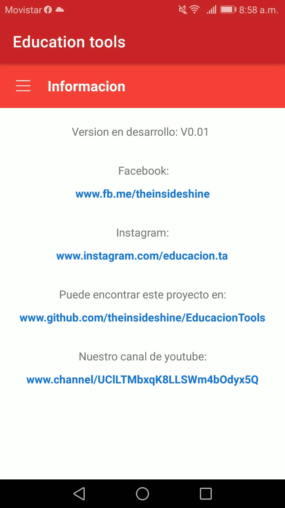
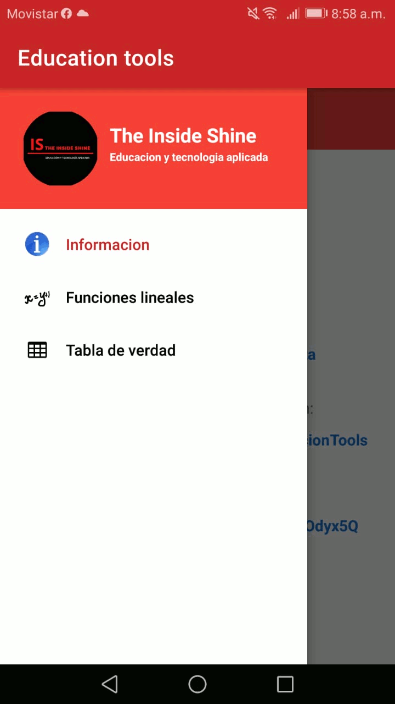
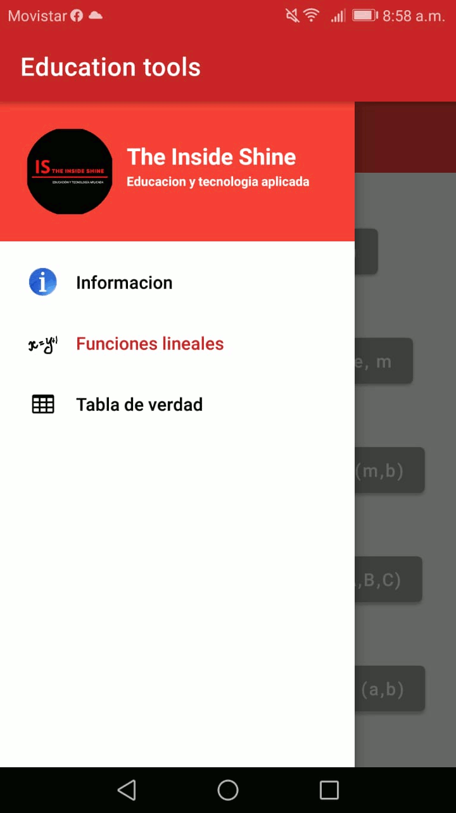
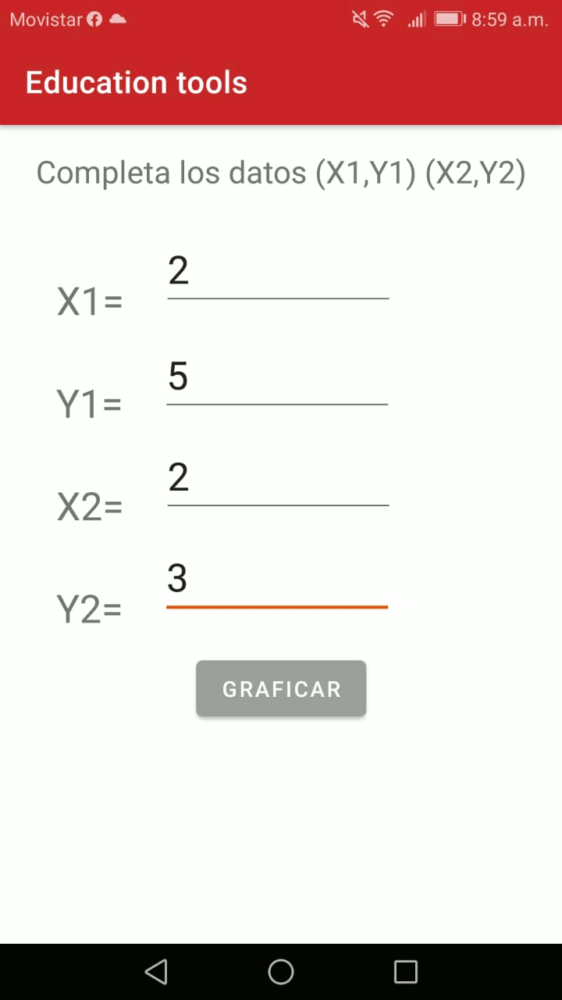
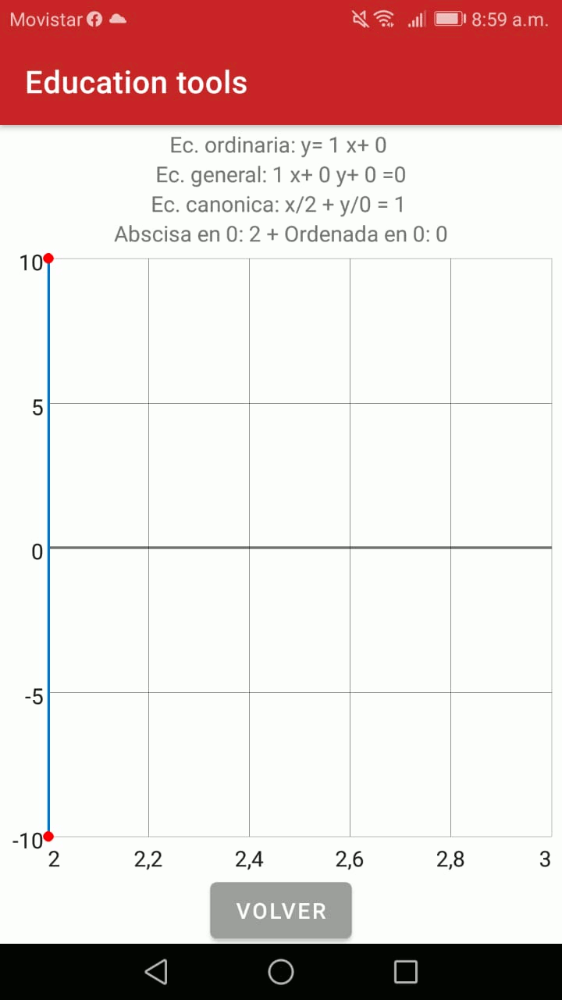
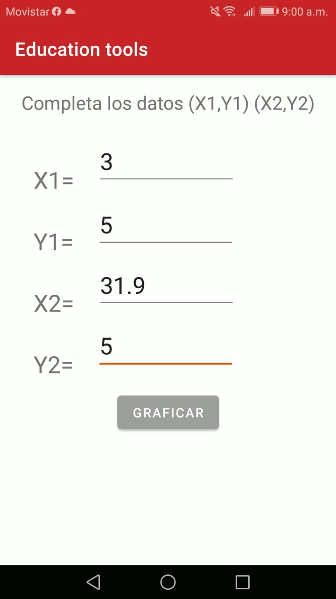
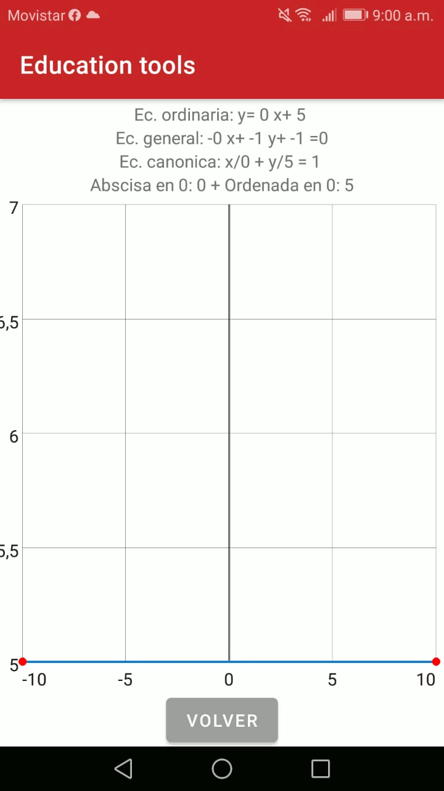
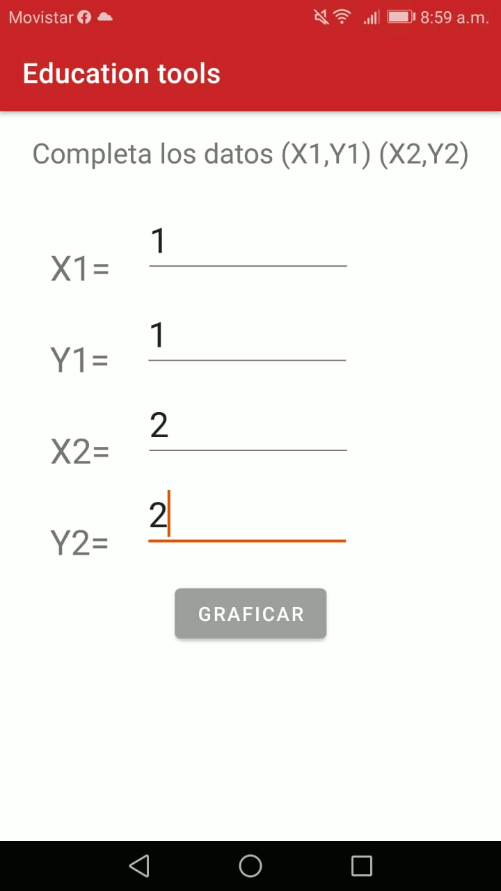
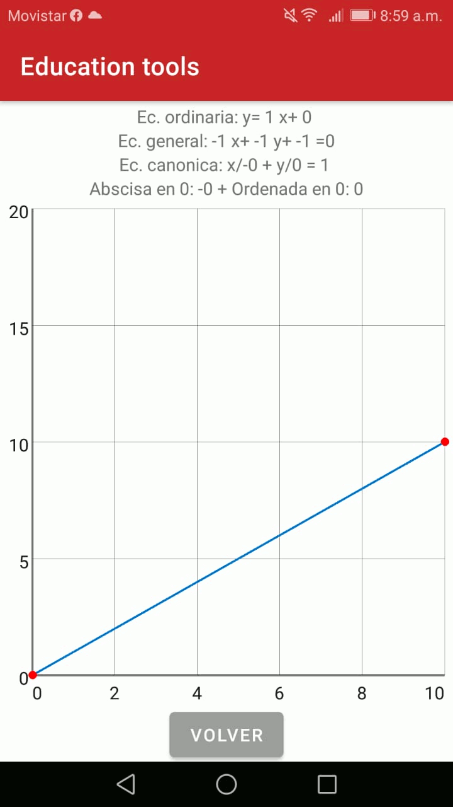
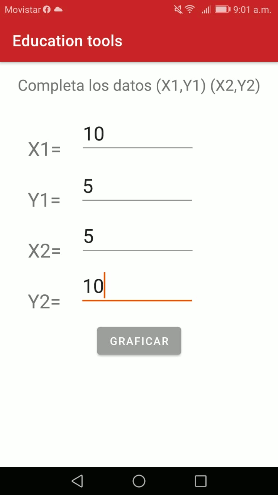
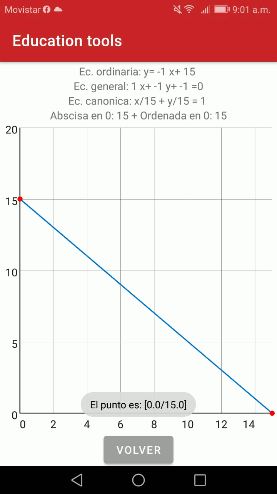
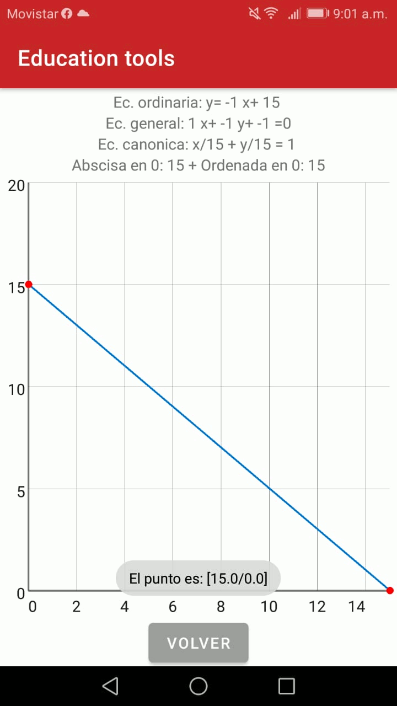

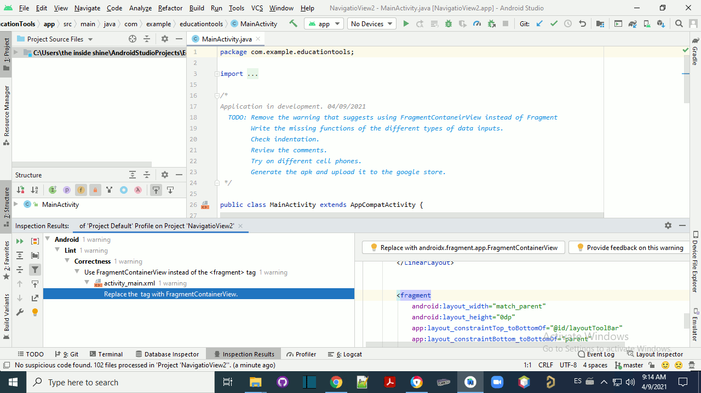

