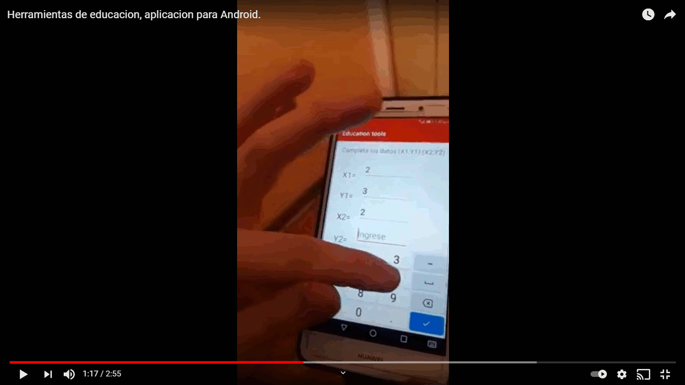

Education tools is a program written in open source Java for Android, the objective is to have in an application all the tools that our students are requesting.
The intention is to add tools at the request of the students.
The application is under development.  
Some images of the application. 

The default fragment contains information about our networks and this repository

The fragment of linear functions is in charge of selecting the data entry option

Input and graph of a constant line at x.

Input and graph of a constant line at y.

Entry and graph of a line through the origin

Entry and graph of a line that passes through the two different points.

Touching the red dots on the graph shows the coordinates of the graph.

Code inspection by android studio

This is my video :https://www.youtube.com/watch?v=CWIGXTgUmb8&t=10s 

